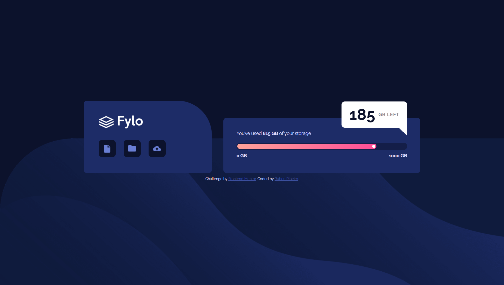
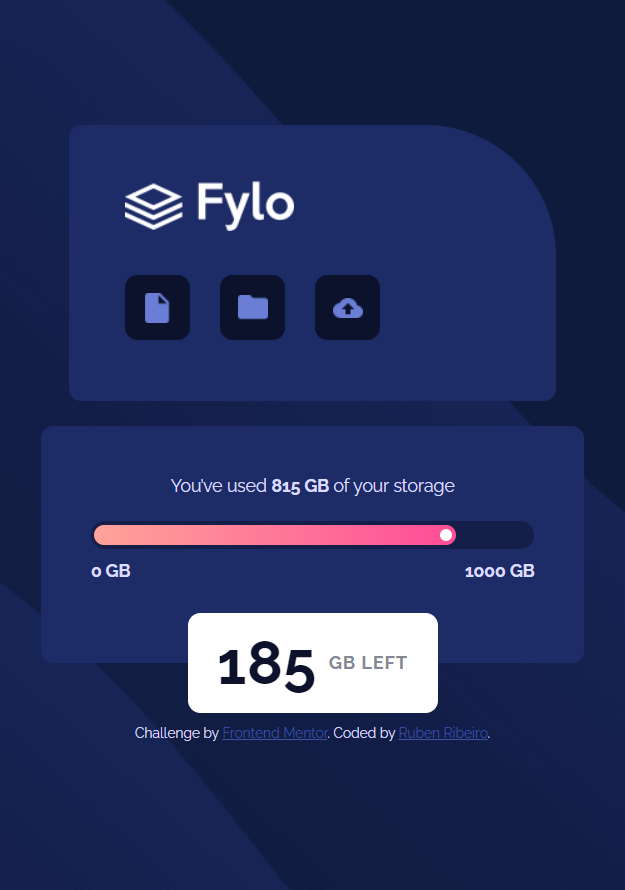

# Frontend Mentor - Fylo data storage component solution

This is a solution to the [Fylo data storage component challenge on Frontend Mentor](https://www.frontendmentor.io/challenges/fylo-data-storage-component-1dZPRbV5n). Frontend Mentor challenges help you improve your coding skills by building realistic projects. 

## Table of contents

- [Overview](#overview)
  - [The challenge](#the-challenge)
  - [Screenshots](#screenshots)
  - [Links](#links)
- [My process](#my-process)
  - [Built with](#built-with)
  - [What I learned](#what-i-learned)
  - [Continued development](#continued-development)
  - [Useful resources](#useful-resources)
- [Author](#author)

## Overview

### The challenge

Users should be able to:

- View the optimal layout for the site depending on their device's screen size

### Screenshots




### Links

- Solution URL: [https://github.com/RubenRibeiro13/fylo-data-storage](https://github.com/RubenRibeiro13/fylo-data-storage)
- Live Site URL: [https://rubenribeiro13.github.io/fylo-data-storage](https://rubenribeiro13.github.io/fylo-data-storage)

## My process

### Built with

- Semantic HTML5 markup
- CSS custom properties
- Flexbox

### What I learned

While working through this project, I learned what pseudo-elements are, when to use the inherit keyword, and how to change the horizontal space between characters, create a linear gradient and reposition an element using the translate function.

```css

.space-left-container {
  display: flex;
  justify-content: center;
  align-items: center;

  background-color: white;
  border-color: white;
  width: 200px;
  height: 80px;
  border-radius: 10px 10px 0 10px;  

  position: absolute;
  right: 40px;
  top: -50px;
}

.space-left-container::after {
  content: "";
  border-top: 12.5px solid;
  border-top-color: inherit;
  border-left: 12.5px solid transparent;
  border-right: 12.5px solid;
  border-right-color: inherit;
  border-bottom: 12.5px solid transparent;

  position: absolute;
  bottom: -25px;
  right: 0;
}

.space-left-item-2 {
  color: hsl(229, 7%, 55%);
  font-weight: 700;
  letter-spacing: 1px;
}

.progress-bar-custom {
  background: linear-gradient(90deg, hsl(6, 100%, 80%), hsl(335, 100%, 65%));
  height: 16px;
  width: 81.5%;
  border-radius: 8px;
  margin-left: 3px;

  display: flex;
  justify-content: flex-end;
  align-items: center;
}

.space-left-container {
  border-radius: 10px;
  bottom: -40px;
  top: auto;
  left: 50%;
  transform: translateX(-50%);
}

```

### Continued development

In my next project, I want to start learning the basics of CSS Grid.

### Useful resources

- [CSS-Tricks](https://css-tricks.com) - This resource gave me an idea of how to add a speech bubble arrow using pseudo-elements and helped me understand when to use the inherit keyword.
- [MDN Web Docs](https://developer.mozilla.org) - This is my go-to resource when I need to use a property or function for the first time, such as letter-spacing or linear-gradient.
- [Stack Overflow](https://stackoverflow.com) - This resource showed me how to center elements with an absolute position using the translate function.

## Author

- Website - [Ruben Ribeiro](https://rubenribeiro13.github.io/my-site)
- Frontend Mentor - [@RubenRibeiro13](https://www.frontendmentor.io/profile/RubenRibeiro13)
